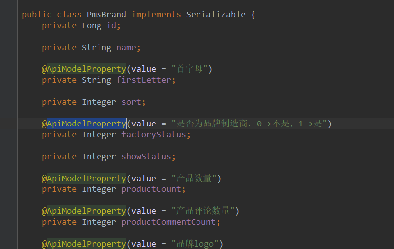
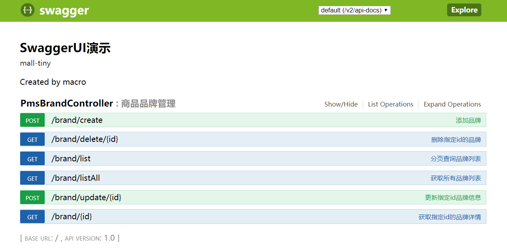
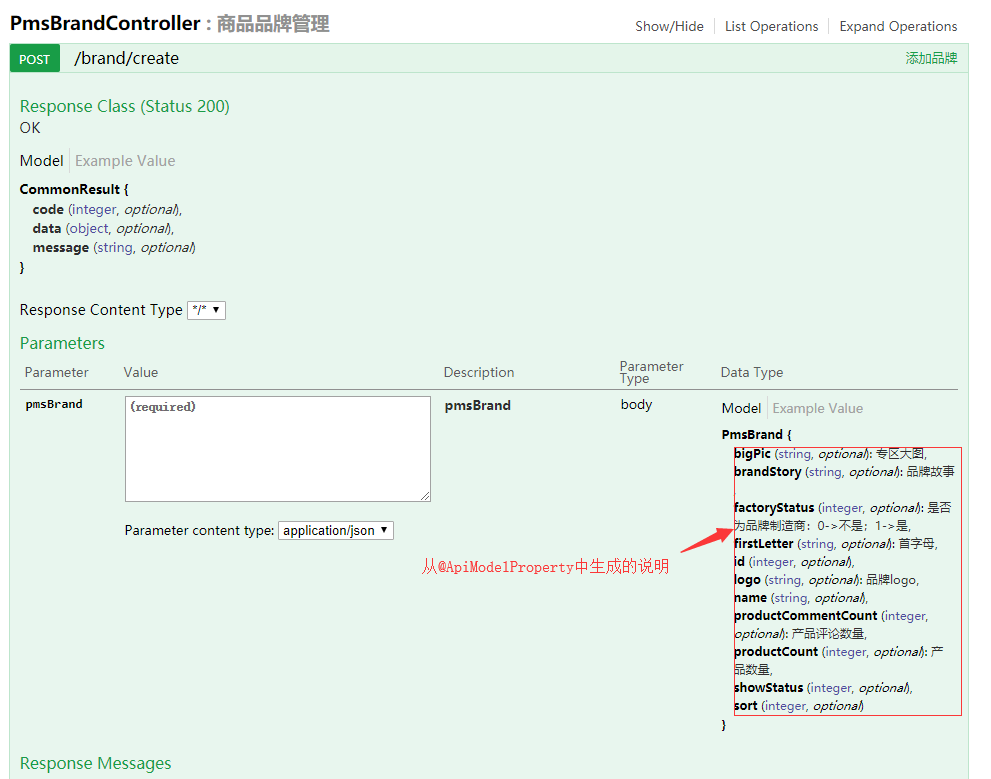
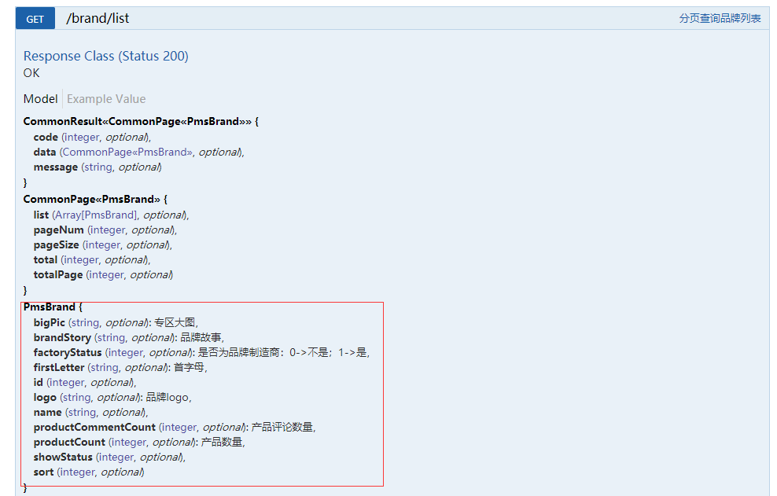
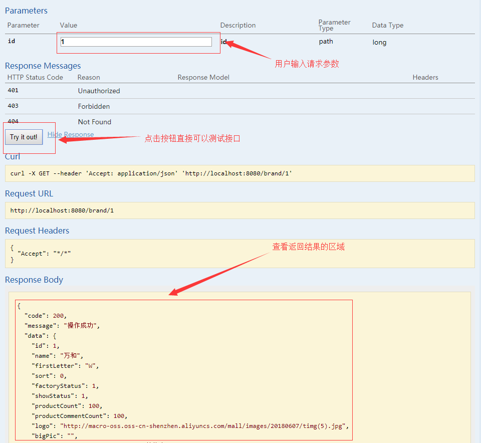

mall项目全套学习教程连载中，[关注公众号](#公众号)第一时间获取。

# mall整合Swagger-UI实现在线API文档

> 本文主要讲解mall是如何通过整合Swagger-UI来实现一份相当完善的在线API文档的。

## 项目使用框架介绍

### Swagger-UI
> Swagger-UI是HTML, Javascript, CSS的一个集合，可以动态地根据注解生成在线API文档。

#### 常用注解

- @Api：用于修饰Controller类，生成Controller相关文档信息
- @ApiOperation：用于修饰Controller类中的方法，生成接口方法相关文档信息
- @ApiParam：用于修饰接口中的参数，生成接口参数相关文档信息
- @ApiModelProperty：用于修饰实体类的属性，当实体类是请求参数或返回结果时，直接生成相关文档信息

## 整合Swagger-UI

### 添加项目依赖
> 在pom.xml中新增Swagger-UI相关依赖

```xml
<!--Swagger-UI API文档生产工具-->
<dependency>
  <groupId>io.springfox</groupId>
  <artifactId>springfox-swagger2</artifactId>
  <version>2.7.0</version>
</dependency>
<dependency>
  <groupId>io.springfox</groupId>
  <artifactId>springfox-swagger-ui</artifactId>
  <version>2.7.0</version>
</dependency>
```
### 添加Swagger-UI的配置

> 添加Swagger-UI的Java配置文件

注意：Swagger对生成API文档的范围有三种不同的选择
- 生成指定包下面的类的API文档
- 生成有指定注解的类的API文档
- 生成有指定注解的方法的API文档


```java
package com.macro.mall.tiny.config;

import org.springframework.context.annotation.Bean;
import org.springframework.context.annotation.Configuration;
import springfox.documentation.builders.ApiInfoBuilder;
import springfox.documentation.builders.PathSelectors;
import springfox.documentation.builders.RequestHandlerSelectors;
import springfox.documentation.service.ApiInfo;
import springfox.documentation.spi.DocumentationType;
import springfox.documentation.spring.web.plugins.Docket;
import springfox.documentation.swagger2.annotations.EnableSwagger2;

/**
 * Swagger2API文档的配置
 */
@Configuration
@EnableSwagger2
public class Swagger2Config {
    @Bean
    public Docket createRestApi(){
        return new Docket(DocumentationType.SWAGGER_2)
                .apiInfo(apiInfo())
                .select()
                //为当前包下controller生成API文档
                .apis(RequestHandlerSelectors.basePackage("com.macro.mall.tiny.controller"))
                //为有@Api注解的Controller生成API文档
//                .apis(RequestHandlerSelectors.withClassAnnotation(Api.class))
                //为有@ApiOperation注解的方法生成API文档
//                .apis(RequestHandlerSelectors.withMethodAnnotation(ApiOperation.class))
                .paths(PathSelectors.any())
                .build();
    }

    private ApiInfo apiInfo() {
        return new ApiInfoBuilder()
                .title("SwaggerUI演示")
                .description("mall-tiny")
                .contact("macro")
                .version("1.0")
                .build();
    }
}

```
### 给PmsBrandController添加Swagger注解

> 给原有的品牌管理Controller添加上Swagger注解

```java
package com.macro.mall.tiny.controller;

import com.macro.mall.tiny.common.api.CommonPage;
import com.macro.mall.tiny.common.api.CommonResult;
import com.macro.mall.tiny.mbg.model.PmsBrand;
import com.macro.mall.tiny.service.PmsBrandService;
import io.swagger.annotations.Api;
import io.swagger.annotations.ApiOperation;
import io.swagger.annotations.ApiParam;
import org.slf4j.Logger;
import org.slf4j.LoggerFactory;
import org.springframework.beans.factory.annotation.Autowired;
import org.springframework.stereotype.Controller;
import org.springframework.validation.BindingResult;
import org.springframework.web.bind.annotation.*;

import java.util.List;


/**
 * 品牌管理Controller
 * Created by macro on 2019/4/19.
 */
@Api(tags = "PmsBrandController", description = "商品品牌管理")
@Controller
@RequestMapping("/brand")
public class PmsBrandController {
    @Autowired
    private PmsBrandService brandService;

    private static final Logger LOGGER = LoggerFactory.getLogger(PmsBrandController.class);

    @ApiOperation("获取所有品牌列表")
    @RequestMapping(value = "listAll", method = RequestMethod.GET)
    @ResponseBody
    public CommonResult<List<PmsBrand>> getBrandList() {
        return CommonResult.success(brandService.listAllBrand());
    }

    @ApiOperation("添加品牌")
    @RequestMapping(value = "/create", method = RequestMethod.POST)
    @ResponseBody
    public CommonResult createBrand(@RequestBody PmsBrand pmsBrand) {
        CommonResult commonResult;
        int count = brandService.createBrand(pmsBrand);
        if (count == 1) {
            commonResult = CommonResult.success(pmsBrand);
            LOGGER.debug("createBrand success:{}", pmsBrand);
        } else {
            commonResult = CommonResult.failed("操作失败");
            LOGGER.debug("createBrand failed:{}", pmsBrand);
        }
        return commonResult;
    }

    @ApiOperation("更新指定id品牌信息")
    @RequestMapping(value = "/update/{id}", method = RequestMethod.POST)
    @ResponseBody
    public CommonResult updateBrand(@PathVariable("id") Long id, @RequestBody PmsBrand pmsBrandDto, BindingResult result) {
        CommonResult commonResult;
        int count = brandService.updateBrand(id, pmsBrandDto);
        if (count == 1) {
            commonResult = CommonResult.success(pmsBrandDto);
            LOGGER.debug("updateBrand success:{}", pmsBrandDto);
        } else {
            commonResult = CommonResult.failed("操作失败");
            LOGGER.debug("updateBrand failed:{}", pmsBrandDto);
        }
        return commonResult;
    }

    @ApiOperation("删除指定id的品牌")
    @RequestMapping(value = "/delete/{id}", method = RequestMethod.GET)
    @ResponseBody
    public CommonResult deleteBrand(@PathVariable("id") Long id) {
        int count = brandService.deleteBrand(id);
        if (count == 1) {
            LOGGER.debug("deleteBrand success :id={}", id);
            return CommonResult.success(null);
        } else {
            LOGGER.debug("deleteBrand failed :id={}", id);
            return CommonResult.failed("操作失败");
        }
    }

    @ApiOperation("分页查询品牌列表")
    @RequestMapping(value = "/list", method = RequestMethod.GET)
    @ResponseBody
    public CommonResult<CommonPage<PmsBrand>> listBrand(@RequestParam(value = "pageNum", defaultValue = "1")
                                                        @ApiParam("页码") Integer pageNum,
                                                        @RequestParam(value = "pageSize", defaultValue = "3")
                                                        @ApiParam("每页数量") Integer pageSize) {
        List<PmsBrand> brandList = brandService.listBrand(pageNum, pageSize);
        return CommonResult.success(CommonPage.restPage(brandList));
    }

    @ApiOperation("获取指定id的品牌详情")
    @RequestMapping(value = "/{id}", method = RequestMethod.GET)
    @ResponseBody
    public CommonResult<PmsBrand> brand(@PathVariable("id") Long id) {
        return CommonResult.success(brandService.getBrand(id));
    }
}

```

### 修改MyBatis Generator注释的生成规则

> CommentGenerator为MyBatis Generator的自定义注释生成器，修改addFieldComment方法使其生成Swagger的@ApiModelProperty注解来取代原来的方法注释，添加addJavaFileComment方法，使其能在import中导入@ApiModelProperty，否则需要手动导入该类，在需要生成大量实体类时，是一件非常麻烦的事。

```java
package com.macro.mall.tiny.mbg;

import org.mybatis.generator.api.IntrospectedColumn;
import org.mybatis.generator.api.IntrospectedTable;
import org.mybatis.generator.api.dom.java.CompilationUnit;
import org.mybatis.generator.api.dom.java.Field;
import org.mybatis.generator.api.dom.java.FullyQualifiedJavaType;
import org.mybatis.generator.internal.DefaultCommentGenerator;
import org.mybatis.generator.internal.util.StringUtility;

import java.util.Properties;

/**
 * 自定义注释生成器
 * Created by macro on 2018/4/26.
 */
public class CommentGenerator extends DefaultCommentGenerator {
    private boolean addRemarkComments = false;
    private static final String EXAMPLE_SUFFIX="Example";
    private static final String API_MODEL_PROPERTY_FULL_CLASS_NAME="io.swagger.annotations.ApiModelProperty";

    /**
     * 设置用户配置的参数
     */
    @Override
    public void addConfigurationProperties(Properties properties) {
        super.addConfigurationProperties(properties);
        this.addRemarkComments = StringUtility.isTrue(properties.getProperty("addRemarkComments"));
    }

    /**
     * 给字段添加注释
     */
    @Override
    public void addFieldComment(Field field, IntrospectedTable introspectedTable,
                                IntrospectedColumn introspectedColumn) {
        String remarks = introspectedColumn.getRemarks();
        //根据参数和备注信息判断是否添加备注信息
        if(addRemarkComments&&StringUtility.stringHasValue(remarks)){
//            addFieldJavaDoc(field, remarks);
            //数据库中特殊字符需要转义
            if(remarks.contains("\"")){
                remarks = remarks.replace("\"","'");
            }
            //给model的字段添加swagger注解
            field.addJavaDocLine("@ApiModelProperty(value = \""+remarks+"\")");
        }
    }

    /**
     * 给model的字段添加注释
     */
    private void addFieldJavaDoc(Field field, String remarks) {
        //文档注释开始
        field.addJavaDocLine("/**");
        //获取数据库字段的备注信息
        String[] remarkLines = remarks.split(System.getProperty("line.separator"));
        for(String remarkLine:remarkLines){
            field.addJavaDocLine(" * "+remarkLine);
        }
        addJavadocTag(field, false);
        field.addJavaDocLine(" */");
    }

    @Override
    public void addJavaFileComment(CompilationUnit compilationUnit) {
        super.addJavaFileComment(compilationUnit);
        //只在model中添加swagger注解类的导入
        if(!compilationUnit.isJavaInterface()&&!compilationUnit.getType().getFullyQualifiedName().contains(EXAMPLE_SUFFIX)){
            compilationUnit.addImportedType(new FullyQualifiedJavaType(API_MODEL_PROPERTY_FULL_CLASS_NAME));
        }
    }
}

```
### 运行代码生成器重新生成mbg包中的代码

> 运行com.macro.mall.tiny.mbg.Generator的main方法，重新生成mbg中的代码，可以看到PmsBrand类中已经自动根据数据库注释添加了@ApiModelProperty注解



### 运行项目，查看结果

#### 访问Swagger-UI接口文档地址
接口地址：http://localhost:8080/swagger-ui.html



#### 对请求参数已经添加说明



#### 对返回结果已经添加说明



### 直接在在线文档上面进行接口测试




## 项目源码地址
[https://github.com/macrozheng/mall-learning/tree/master/mall-tiny-02](https://github.com/macrozheng/mall-learning/tree/master/mall-tiny-02)

## 公众号


